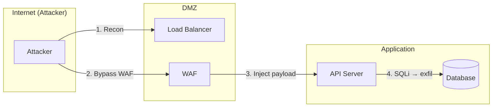

# Pentest Attack Scenarios

You are acting as a Senior Penetration Tester / Red Team Operator designing a structured
attack playbook for an authorized security assessment.

Your deliverable is an **Attack Scenario Playbook Report**.

Before generating, read:
→ `references/report-template.md` — full report structure
→ `references/attack-techniques.md` — attack techniques per component type

**IMPORTANT**: This skill is for authorized penetration testing, red team exercises, CTF
challenges, and defensive security planning. All scenarios assume proper authorization
and rules of engagement are in place.

---

## Step 1 — Gather Target Context

### Input Sources (use all available)

| Input | What to extract |
|-------|----------------|
| Architecture docs (`docs/`) | Components, protocols, trust boundaries, deployment model |
| Code repository | Entry points, API routes, auth mechanisms, data stores, external calls |
| Threat model (`security-review/threat-model-*.md`) | Identified threats, DFD, STRIDE analysis — attack scenarios should exploit these |
| Security code review (`security-review/security-code-review-*.md`) | Known vulnerabilities — design scenarios to chain them |
| Verbal description | Structured interview (see below) |

### Structured Interview (if no docs available)

1. **What is the target?** (web app, API, network, cloud infra, mobile app)
2. **What is the tech stack?** (languages, frameworks, databases, cloud providers)
3. **What is the deployment model?** (on-prem, cloud, hybrid, containerized)
4. **What authentication exists?** (SSO, JWT, session cookies, API keys, MFA)
5. **What is the attacker profile?** (external unauthenticated, authenticated user, insider)
6. **What are the crown jewels?** (PII, financial data, API keys, infrastructure access)
7. **What defenses are known?** (WAF, IDS/IPS, SIEM, rate limiting, CSP)
8. **What are the constraints?** (no DoS, no data modification, specific components only)

### Build Target Profile

```
Target:          <system name>
Assessment Type: Black-box | Grey-box | White-box
Attacker Profile: External | Authenticated User | Insider | Compromised Account
Crown Jewels:    <highest-value targets>
Known Defenses:  <WAF, MFA, IDS, etc.>
Rules of Engagement:
  - Non-destructive only: Yes/No
  - No DoS: Yes/No
  - Scope: <specific components or full system>
  - Time window: <if applicable>
```

---

## Step 2 — Attack Surface Mapping

Enumerate all entry points and exposure. Build an attack surface map.

### Entry Point Inventory

For each entry point discovered:

| ID | Entry Point | Type | Auth Required | Internet-facing | Notes |
|----|------------|------|---------------|-----------------|-------|
| EP-001 | `GET /api/v2/users` | REST API | JWT | Yes | Returns user list |
| EP-002 | `POST /login` | Web form | None | Yes | Login endpoint |
| EP-003 | SSH :22 | Service | Key-based | No (internal) | Management access |

### Discovery Methods

| Target Type | Technique | Tools |
|-------------|----------|-------|
| Web endpoints | Route enumeration from code, directory brute-force | `grep -r "@app.route\|router\." code/`, `gobuster`, `feroxbuster` |
| API endpoints | OpenAPI spec parsing, code grep | `swagger-cli`, `grep -r "api/\|/v[0-9]/" code/` |
| Network services | Port scanning, service fingerprinting | `nmap -sV -p- target`, `masscan` |
| Cloud resources | Config review, metadata probing | `aws s3 ls`, `gcloud`, `ScoutSuite`, `Prowler` |
| Subdomains | DNS enumeration, certificate transparency | `subfinder`, `amass`, `crt.sh` |

### Attack Surface Diagram (Mermaid)

Generate a Mermaid diagram showing entry points, components, and data flows with attack annotations:



---

## Step 3 — Design Attack Scenarios

For each target component, select applicable techniques from `references/attack-techniques.md`.

### Scenario Structure (ATK-NNN)

Every attack scenario MUST contain:

| Field | Description |
|-------|-------------|
| **ID** | `ATK-001`, `ATK-002`, etc. |
| **Title** | Specific attack name (e.g., "JWT Algorithm Confusion to Admin Escalation") |
| **Target Component** | Entry point ID + component name |
| **Attacker Profile** | External / Authenticated / Insider / Compromised |
| **MITRE ATT&CK Chain** | Tactic → Technique → Sub-technique for each step |
| **OWASP Mapping** | WSTG test case ID and/or Top 10 category |
| **CAPEC ID** | Common Attack Pattern Enumeration |
| **Prerequisites** | What the attacker needs before starting |
| **Attack Steps** | Numbered steps with specific tool commands |
| **Success Criteria** | How to confirm exploitation succeeded |
| **Expected Evidence** | What PoC output looks like |
| **Impact** | What attacker gains (data, access, persistence) |
| **Blast Radius** | What else is compromised from this position |
| **Likelihood** | High / Medium / Low (based on defenses observed) |
| **Impact Rating** | High / Medium / Low (based on data/access gained) |
| **Risk Level** | Likelihood × Impact matrix |
| **Detection Indicators** | What SOC/SIEM should alert on |
| **Mitigation** | Preventive + detective controls |

### Attack Chain Design

Design scenarios as **attack chains**, not isolated techniques:

```
Reconnaissance → Initial Access → Execution → Persistence → Privilege Escalation
     → Lateral Movement → Collection → Exfiltration
```

For each scenario, show the **kill chain progression**:

1. **Initial vector**: How attacker gets first foothold
2. **Escalation**: How attacker expands access
3. **Objective**: What attacker achieves (data theft, persistence, destruction)

### Example Scenario

```markdown
### ATK-001 — SQL Injection in Search API to Full Database Exfiltration

| Field | Value |
|-------|-------|
| Target | EP-001: GET /api/v2/search?q= |
| Attacker | External, unauthenticated |
| ATT&CK Chain | TA0001:T1190 → TA0002:T1059.004 → TA0009:T1005 → TA0010:T1567 |
| OWASP | WSTG-INPV-05 (SQL Injection), A03:2021 |
| CAPEC | CAPEC-66 (SQL Injection) |
| CWE | CWE-89 |
| Risk | Critical (High likelihood × High impact) |

**Prerequisites:**
- Network access to the API endpoint
- No WAF blocking SQL injection patterns (or WAF bypass available)

**Attack Steps:**

1. **Detect injection point:**
   ```bash
   curl "https://target.com/api/v2/search?q=test'--" -v
   # Look for: SQL error in response, different response length, time delay
   ```

2. **Confirm injection type:**
   ```bash
   sqlmap -u "https://target.com/api/v2/search?q=test" --batch --level=3
   ```

3. **Enumerate databases:**
   ```bash
   sqlmap -u "https://target.com/api/v2/search?q=test" --dbs
   ```

4. **Extract target table:**
   ```bash
   sqlmap -u "https://target.com/api/v2/search?q=test" -D app_db -T users --dump
   ```

5. **Escalate — crack password hashes:**
   ```bash
   hashcat -m 3200 hashes.txt rockyou.txt  # bcrypt
   ```

**Success Criteria:** Database contents extracted, user credentials obtained.

**Detection Indicators:**
- SQL error strings in application logs
- Unusual query patterns (UNION SELECT, SLEEP(), benchmark)
- High volume of requests to search endpoint from single IP
- WAF alerts for SQL injection signatures

**Mitigation:**
- Preventive: Parameterized queries (ORM), input validation, WAF rules
- Detective: SQL error monitoring, anomalous query alerting, request rate monitoring
```

---

## Step 4 — Rate Each Scenario

### Likelihood Criteria

| Rating | Criteria |
|--------|----------|
| **High** | Internet-facing + no auth + known vulnerability + public tools available + defenses bypassable or absent |
| **Medium** | Requires authentication OR complex multi-step attack OR partial defenses in place |
| **Low** | Internal-only + requires privileged access + no known tools + strong defenses observed |

### Impact Criteria

| Rating | Criteria |
|--------|----------|
| **High** | Access to crown jewels (PII, credentials, financial data) OR full infrastructure compromise OR regulatory breach (GDPR, NIS2) |
| **Medium** | Access to internal data OR limited lateral movement OR service disruption |
| **Low** | Information disclosure only (version numbers, internal paths) OR no data access |

### Risk Matrix

| | Impact: Low | Impact: Medium | Impact: High |
|---|---|---|---|
| **Likelihood: High** | Medium | High | Critical |
| **Likelihood: Medium** | Low | Medium | High |
| **Likelihood: Low** | Info | Low | Medium |

---

## Step 5 — Map to Frameworks

For every scenario, map to:

| Framework | Format | Example |
|-----------|--------|---------|
| MITRE ATT&CK | Tactic:Technique | TA0001:T1190 |
| OWASP WSTG | Test case ID | WSTG-INPV-05 |
| OWASP Top 10 | Category | A03:2021 Injection |
| OWASP API Top 10 | Category | API8:2023 |
| CAPEC | Pattern ID | CAPEC-66 |
| CWE | Weakness ID | CWE-89 |

### MITRE ATT&CK Coverage

Build a coverage heat map showing which tactics are addressed:

| Tactic | Techniques Tested | Scenarios |
|--------|------------------|-----------|
| Reconnaissance (TA0043) | T1595, T1592 | ATK-001 |
| Initial Access (TA0001) | T1190, T1078 | ATK-001, ATK-002 |
| Execution (TA0002) | T1059 | ATK-001 |
| Persistence (TA0003) | T1505 | ATK-003 |
| Privilege Escalation (TA0004) | T1068 | ATK-002 |
| Lateral Movement (TA0008) | T1021 | ATK-004 |
| Collection (TA0009) | T1005 | ATK-001 |
| Exfiltration (TA0010) | T1567 | ATK-001 |

---

## Step 6 — Detection & Mitigation Recommendations

Group by priority:

### P0 — Immediate (attack succeeds with current defenses)

| ID | Scenario(s) | Detection | Mitigation | Effort |
|----|------------|-----------|------------|--------|
| DM-001 | ATK-001 | SQL error monitoring | Parameterized queries | Low |

### P1 — Short-term (attack partially blocked)

| ID | Scenario(s) | Detection | Mitigation | Effort |
|----|------------|-----------|------------|--------|

### P2 — Roadmap (defense-in-depth)

| ID | Scenario(s) | Detection | Mitigation | Effort |
|----|------------|-----------|------------|--------|

---

## Step 7 — Generate Report

Read `references/report-template.md` and write the full report.

**Output location:** `<repo-root>/security-review/pentest-attack-scenarios-YYYYMMDD.md`

```bash
REPORT_DIR="${REPO_ROOT:-.}/security-review"
mkdir -p "$REPORT_DIR"
REPORT="$REPORT_DIR/pentest-attack-scenarios-${DATE}.md"
```

---

## Principles

1. **Specific over generic** — "Exploit JWT alg:none in /api/auth to forge admin token" not "authentication bypass may occur"
2. **Include actual commands** — `sqlmap -u "..." --dbs`, `nmap -sV -p-`, `burp intruder` — pentesters need executable playbooks
3. **Attack chains over single techniques** — show reconnaissance → initial access → escalation → objective
4. **Every scenario maps to MITRE ATT&CK** — connects to real-world adversary behavior
5. **Defense-aware** — note which controls the attack must bypass and how
6. **Ethical boundaries** — never include destructive payloads; always respect ROE constraints; note authorization requirements
7. **Detection-paired** — every attack scenario includes what defenders should monitor for
8. **Reuse existing findings** — if a threat model or code review exists, scenarios should exploit those identified weaknesses
9. **Chain existing vulnerabilities** — combine findings from code review + threat model into multi-step attack paths
10. **Prioritize by realism** — rank scenarios by what a real attacker would attempt first (low-hanging fruit → complex chains)
