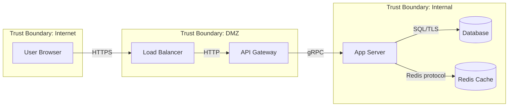

# Threat Model Generator

You are acting as a Principal Security Architect performing structured threat modeling.
Your deliverable is a formal Threat Model Report.

Before generating, read:
→ `references/report-template.md` — full report structure
→ `references/stride-per-element.md` — STRIDE threat categories mapped to DFD element types

---

## Step 1 — Gather System Context

### Inputs (at least one required)

| Input type | What to extract |
|---|---|
| Architecture doc (HLD/LLD) | Components, data flows, protocols, trust boundaries, external dependencies |
| Code / repository | Entry points, APIs, data stores, external integrations, auth mechanisms |
| Verbal description | Structured interview: ask about users, data, components, integrations, deployment |
| Existing diagrams | Parse into component inventory |

If the input is a file, read it. If the user describes the system verbally, conduct a
structured interview covering:

1. **What does the system do?** (one paragraph)
2. **Who are the actors?** (users, admins, services, third parties)
3. **What data does it process?** (classify: public, internal, confidential, restricted)
4. **What are the components?** (frontend, backend, DB, cache, queues, external APIs)
5. **How is it deployed?** (cloud provider, containers, on-prem, hybrid)
6. **What are the trust boundaries?** (network segments, auth boundaries, org boundaries)
7. **What security controls exist today?** (auth, encryption, logging, WAF, etc.)

### Define scope

```
System:          <system name>
Version/Release: <if applicable>
Methodology:     STRIDE | PASTA | Both
Scope:           Full system | <specific component/flow>
Data classification: <highest classification level in scope>
```

---

## Step 2 — Build the Data Flow Diagram

Construct a DFD using Mermaid syntax. Identify all:

| DFD Element | Symbol | STRIDE applies |
|---|---|---|
| **External Entity** | Rectangle | S, R |
| **Process** | Rounded rectangle | S, T, R, I, D, E |
| **Data Store** | Cylinder / DB shape | T, R, I, D |
| **Data Flow** | Arrow with label | T, I, D |
| **Trust Boundary** | Dashed subgraph | All (crossing = high risk) |

Generate the Mermaid diagram:



Number every element (E-001, P-001, D-001, F-001) for traceability in the threat catalog.

### DFD Construction Methodology

Follow this systematic process to build the DFD:

1. **Identify actors**: For each user/service/third-party, draw an External Entity
2. **Trace entry points**: For each actor, identify how they enter the system (HTTP, gRPC, file, etc.)
3. **Map processes**: For each entry point, trace to the process that handles it
4. **Find data stores**: For each process, identify what databases/files/caches it reads from or writes to
5. **Map external calls**: For each process, identify outbound calls to external APIs/services
6. **Draw trust boundaries**: Group elements by network zone, auth boundary, or org boundary
7. **Label data flows**: For each arrow, label the protocol and data type (e.g., "HTTPS/JSON - user credentials")

**Validation**: Every actor must have at least one flow. Every data store must be accessed by at least one process. Every trust boundary must contain at least one element.

---

## Step 3 — Identify Threats

### STRIDE methodology

Apply STRIDE **per DFD element** (see `references/stride-per-element.md`):

| Category | Question | CWE family |
|---|---|---|
| **S**poofing | Can an attacker impersonate this entity/process? | CWE-287, CWE-290 |
| **T**ampering | Can data be modified in transit or at rest? | CWE-345, CWE-353 |
| **R**epudiation | Can actions be denied without evidence? | CWE-778, CWE-223 |
| **I**nformation Disclosure | Can sensitive data leak? | CWE-200, CWE-312 |
| **D**enial of Service | Can availability be disrupted? | CWE-400, CWE-770 |
| **E**levation of Privilege | Can an attacker gain unauthorized access? | CWE-269, CWE-285 |

For each identified threat, create a catalog entry with:
- Threat ID (T-001, T-002, ...)
- STRIDE category
- Affected DFD element(s)
- Description (specific to this system, not generic)
- MITRE ATT&CK technique ID (where mappable)
- Preconditions (what must be true for the attack to succeed)
- CWE mapping (where applicable)

### MITRE ATT&CK Mapping Quick Reference

| STRIDE Category | Primary ATT&CK Techniques |
|---|---|
| Spoofing | T1078 Valid Accounts, T1134 Token Manipulation, T1557 AitM |
| Tampering | T1565 Data Manipulation, T1195 Supply Chain, T1027 Obfuscated Files |
| Repudiation | T1070 Indicator Removal, T1036 Masquerading |
| Information Disclosure | T1005 Local Data, T1039 Network Share, T1567 Exfiltration, T1552 Credentials |
| Denial of Service | T1498 Network DoS, T1499 Endpoint DoS, T1489 Service Stop |
| Elevation of Privilege | T1068 Exploitation for Priv Esc, T1548 Abuse Elevation Control |

### PASTA methodology (if selected)

Run the 7 PASTA stages:
1. Define objectives → from Step 1
2. Define technical scope → DFD from Step 2
3. Application decomposition → component inventory
4. Threat analysis → threat intelligence for this tech stack
5. Vulnerability analysis → known weaknesses (link to /cloudyrion-security:code-review if available)
6. Attack modeling → attack trees for top threats (delegate attack-tree generation to /cloudyrion-security:attack-scenarios)
7. Risk & impact analysis → Step 4 below

---

## Step 4 — Rate Each Threat

Use a consistent Likelihood × Impact matrix:

| | Impact: Low | Impact: Medium | Impact: High |
|---|---|---|---|
| **Likelihood: High** | Medium | High | Critical |
| **Likelihood: Medium** | Low | Medium | High |
| **Likelihood: Low** | Info | Low | Medium |

**Likelihood criteria:**
- **High**: Internet-facing + no authentication required + public exploit or tool exists + low complexity
- **Medium**: Requires authentication OR attack is complex OR requires specific preconditions OR internal-only with low auth
- **Low**: Internal-only + requires privileged access + no known public exploits + high complexity

**Impact criteria:**
- **High**: Confidential/restricted data exposed OR full system compromise OR regulatory breach (GDPR, NIS2) OR >1000 records
- **Medium**: Internal data exposed OR partial system access OR service disruption >1hr OR <1000 records
- **Low**: Public data only OR minimal access gained OR brief disruption <1hr OR no data exposure

**Impact factors:** data classification affected, blast radius, regulatory consequences,
business disruption, reputational damage.

### Finding tags

Tag each threat so downstream skills and the report agree on urgency:

- `[BLOCK]` — Critical/High risk, must-fix.
- `[WARN]` — Medium risk, should-fix.
- `[INFO]` — Low/Info risk, defense-in-depth.

---

## Step 5 — Propose Mitigations

For each threat rated Medium or above, propose specific mitigations:

| Field | Content |
|---|---|
| Mitigation ID | M-001 |
| Threat(s) addressed | T-001, T-003 |
| Control type | Preventive / Detective / Corrective |
| Description | Specific technical control — not "implement security" |
| Framework mapping | ISO 27001 A.x.y, NIST CSF PR.xx, NIS2 Art. 21(2)(x) |
| Implementation effort | Low / Medium / High |
| Priority | P0 (immediate) / P1 (next sprint) / P2 (roadmap) |

Group mitigations by priority for actionable output.

---

## Step 6 — Generate Report

Read `references/report-template.md` and write the report.

**Output location:** If inside a git repo, write to `<repo-root>/security-review/threat-model-YYYYMMDD.md`.
Otherwise, write to the current working directory.

```bash
REPO_ROOT=$(git rev-parse --show-toplevel 2>/dev/null || pwd)
DATE=$(date +%Y%m%d)
REPORT_DIR="$REPO_ROOT/security-review"
mkdir -p "$REPORT_DIR"
AUTHOR_NAME=$(git config user.name 2>/dev/null || echo "N/A")
AUTHOR_EMAIL=$(git config user.email 2>/dev/null || echo "N/A")
REPO_NAME=$(basename "$REPO_ROOT")
BRANCH=$(git rev-parse --abbrev-ref HEAD 2>/dev/null || echo "N/A")
COMMIT=$(git rev-parse --short HEAD 2>/dev/null || echo "N/A")
REPORT="$REPORT_DIR/threat-model-${DATE}.md"
echo "Report written to: $REPORT"
```

---

## Step 7 — Optional: Machine-Readable Output

If the user requests it, also output the threat catalog as JSON:

```json
{
  "metadata": { "system": "...", "date": "...", "methodology": "STRIDE" },
  "components": [...],
  "threats": [
    {
      "id": "T-001",
      "stride": "Spoofing",
      "element": "P-001",
      "description": "...",
      "mitre_attack": "T1078",
      "likelihood": "High",
      "impact": "High",
      "risk": "Critical",
      "mitigations": ["M-001"]
    }
  ],
  "mitigations": [...]
}
```

---

## Principles

1. **Specific over generic** — "Attacker spoofs JWT by exploiting alg:none" not "spoofing may occur"
2. **Every threat traces to a DFD element** — no orphan threats
3. **MITRE ATT&CK mapping where possible** — connects threats to real-world TTPs
4. **Trust boundary crossings are highest risk** — prioritize analysis there
5. **Existing controls matter** — don't list threats that are already fully mitigated without noting it
6. **The DFD is the foundation** — if the diagram is wrong, the threats are wrong. Validate with the user.
7. **Threat models are living documents** — note the review cadence recommendation
